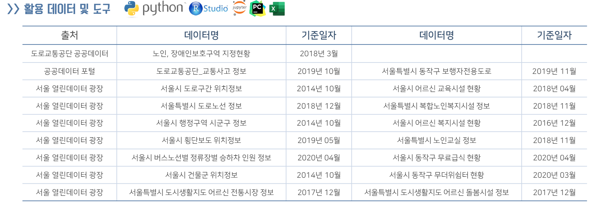

# 동작구 빅데이터 공모전

### ■ 팀이름 : 동작하라
### ■ 준비기간 : 20.04 ~ 20.05 (약 2달)
### ■ 주제 : 노인 보호구역 추가 지정
### ■ 방법 : 공공 데이터 활용 노인 교통사고 위험지역 분류 및 지역 군집화
- 자세한 내용은 아이디어 제안서 pdf 파일에 있음.
### ■ 결과 : 우수상

### ■ 참고 URL
- https://namu.wiki/w/%EB%8F%99%EC%9E%91%EA%B5%AC // 동작구 나무위키
- http://www.law.go.kr/%EB%B2%95%EB%A0%B9/%EB%8F%84%EB%A1%9C%EA%B5%90%ED%86%B5%EB%B2%95 // 도로교통법
- https://www.code.go.kr/index.do // 행정표준코드관리시스템
- https://blog.acronym.co.kr/283 // GIS 지도 좌표계에 대한 정리
- https://m.blog.naver.com/PostView.nhn?blogId=wideeyed&logNo=221243506770&proxyReferer=https:%2F%2Fwww.google.com%2F // 좌표변환 PYTHON 예제
- https://blog.naver.com/PostView.nhn?blogId=wideeyed&logNo=221243506770 // 좌표변환 PYTHON 예제 2
- http://data.dongjak.go.kr/index.jsp // 동작구 열린 데이터 광장
- https://www.google.com/maps/ // 구글지도
- http://data.seoul.go.kr/dataList/OA-11657/S/1/datasetView.do // 서울시 횡단보도 위치 정보
- http://mn.kbs.co.kr/news/view.do?ncd=4260111 // KBS News - 폭염에도 텅빈 무더위쉼터
- https://statkclee.github.io/spatial/geo-spatial-r.html // 공간통계를 위한 데이터 사이언스
- https://epsg.io/transform#s_srs=4326&t_srs=3857&x=126.9500236&y=37.5126247 // epsg.io 
- https://www.osgeo.kr/17 // 한국 주요 좌표계 EPSG 코드 및 proj4 인자 정리
- https://navermaps.github.io/maps.js/docs/naver.maps.UTMK.html // UTM-K 네이버

### ■ 사용 데이터

### ■ 소감
- 아직 개념적 지식이 많이 부족한 상태에서 대회에 참여했던 거라 스스로 부족한 점이 있어 아쉽게 느껴졌음. 그래도 정말 좋고 능력있는 팀원을 만나서 옆에서 많이 배우면서 현재 할 수 있는 최선의 노력을 다하려고 했던 것 같음. (그 후 많이 자극을 받아서 현재까지 열심히 공부중) 초반엔 상암에 빅데이터 캠퍼스에서 유동인구 공공데이터를 많이 활용했었는데 여러모로 불편한 점이 많았었음. 좌표계에 대해서 이번에 정말 많이 공부하게 됬는데 기업마다 쓰는 좌표계도 다르고 EPSG도 다 달랐고 공공 데이터도 EPSG가 통일되지 않아서 직접 지도에 데이터 검증해보고, 좌표계를 변환해 가면서 데이터를 사용하였음. 전체적으로 공부는 많이 됬고, 정말 운이 좋게도 수상을 하게 되서, 정말 값진 경험이였다고 생각함.
